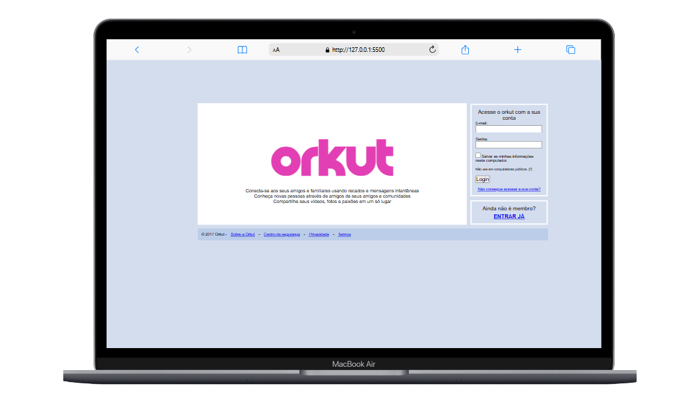

# Cópia do site orkut para fins didáticos 

O intuito deste repositório é melhorar as técinas de ultilização do "input", no expoto, foi clonado o site do orkut para fins didáticos 

    

## Site proposto: Orkut

- [x]  Estrutura HTML
- [x] Organizando arquitetura de projetos font 
    - assetes
        - img
        - fonts
- [x] Realizando primeiro commit
- [x] Estilo inicial CSS
- [ ] Realizando segundo commit
- [x] Enviando ao github